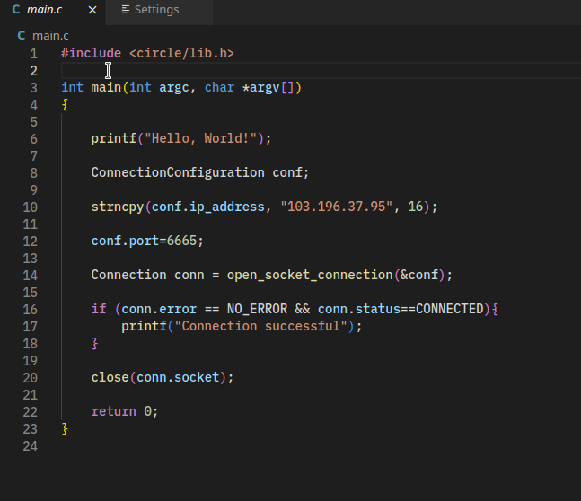

# capibara README

capibara-vs-code is the visual studio code plugin for using Capibara documentation.

## Features

- Hover documentation based on the the crowd-sourced C library definitions contributed to Capibara.
- Custom definitions file URL setting for ease of debugging, hosting, and maintaining your own documentation.

## Commands

Documentation is hover activated. You can manually trigger a redownload of the documentation via the `capibara.fetchLatestDefinitions` command.
Presented as Capibara: Fetch Latest Definitions.

## Requirements

This extension utilizes the vscode file downloader extension. You should be prompted upon plugin initialization to install this.

## Extension Settings

This extension contributes the following settings:

- `capibara.definitionsFileURL`: This is the URL that capibara will use to download definitions.

## Release Notes

### 1.0.0

Initial release of capibara-vs-code.

---

## For more information

- [Capibara](https://capibara.tools/)

**Enjoy!**
